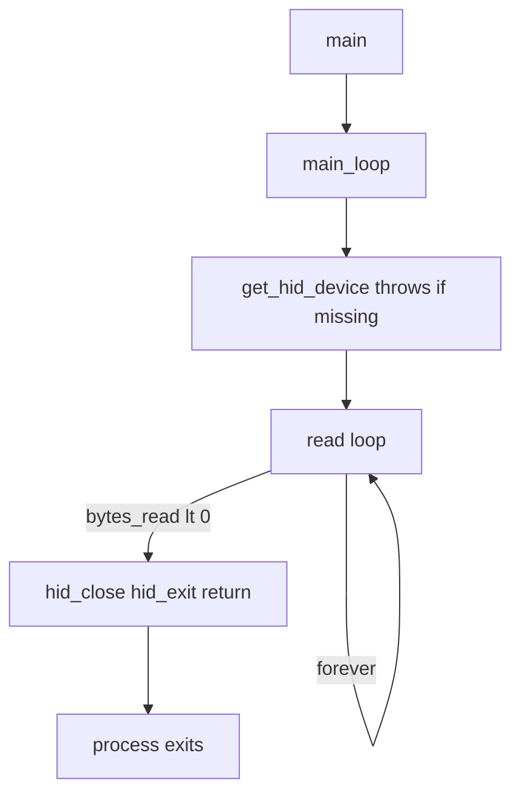

# Continuous headset reconnect for `emotiv_lsl`

## Current behavior (why the app exits)

1. **Startup**: [`get_hid_device()`](src/emotiv/emotiv_base.cpp) throws `std::runtime_error("Emotiv headset not found")` (or HID init failure). [`main()`](src/emotiv/main.cpp) catches, prints, returns `1` → process exits.

2. **After connect**: [`main_loop()`](src/emotiv/emotiv_base.cpp) reads in a `while (true)` loop. On `hid_read` &lt; 0 it logs, **breaks**, calls `requestStop()` on the recorder if any, `hid_close`, `hid_exit`, and **returns** → `main()` returns `0` → process exits.

## Target behavior

- **Outer infinite loop** in `EmotivBase::main_loop()` (until the OS terminates the process on window close or Ctrl+C).
- **Connect phase**: If no device, log once per retry and `sleep_for` a fixed interval (e.g. 1–2 s) to avoid a busy spin; repeat until open succeeds.
- **Read phase**: Same logic as today; on `bytes_read < 0`, log that reconnect will be attempted, `hid_close` the handle, **reset** `eeg_outlet` / `motion_outlet` / `eeg_quality_outlet` so the next session creates fresh LSL streams, then continue the outer loop.
- **HID lifecycle**: Call `hid_init()` once at the start of `main_loop()` (throw on failure — unchanged severity). Call `hid_exit()` only when `main_loop()` truly ends (in practice the process is usually killed first; this keeps the API balanced if the function ever returns).

## Code changes (single focal file + small header touch)

Primary implementation in [`src/emotiv/emotiv_base.cpp`](src/emotiv/emotiv_base.cpp):

- Add `#include <thread>` for `std::this_thread::sleep_for`.
- Introduce a **`constexpr` retry interval** (or `static const` duration) for “no device” and optionally reuse a short sleep after disconnect (same interval is fine).
- **Extract** the enumeration/open logic from `get_hid_device()` into a new protected helper, e.g. `find_open_emotiv_device()`, that:
  - **Does not** call `hid_init()` / `hid_exit()`.
  - Returns `nullptr` if no Emotiv interface is found (no throw).
- Refactor **`get_hid_device()`** (still used by [`get_crypto_key()`](src/emotiv/emotiv_epoc_x.cpp) when `serial_number` is empty) to: `hid_init()` → `find_open_emotiv_device()` → throw if null (preserve existing contract for that rare path).
- Restructure **`main_loop()`** roughly as:
  - `hid_init()` once; throw if nonzero.
  - `while (true)` {
    - `while (!device)` { `device = find_open_emotiv_device();` if null, log + sleep }
    - log connected
    - **First successful connect only**: if `record_file` non-empty and `!recorder`, build `watchfor` / construct `recording` (same as today, **after** device is open so `get_lsl_source_id()` still sees a populated `serial_number`).
    - Inner read loop: existing decode / outlet creation / push logic.
    - On read error: log, `break` inner loop.
    - `if (recorder) recorder->requestStop();` — **same as today** when the session ends (see note below).
    - `hid_close(device);` reset the three `unique_ptr` outlets; reset `has_motion_data = false` for sensible logging on the next session.
  - }
  - `hid_exit()` after the outer loop (unreachable in the normal “infinite” design unless you later add a shutdown flag).

Declare `find_open_emotiv_device()` in [`src/emotiv/emotiv_base.h`](src/emotiv/emotiv_base.h) under `protected` next to `get_hid_device()`.

[`src/emotiv/main.cpp`](src/emotiv/main.cpp): **No change required** for Ctrl+C / close — default process termination already applies. Keep the `try`/`catch` for genuine fatal exceptions (e.g. HID init failure).

## `--record` / XDF behavior (explicit tradeoff)

Today, `requestStop()` runs when the read loop exits, which **finalizes** the background recording. Keeping that call on each HID disconnect means **XDF recording will not resume** on reconnect without a larger redesign (new `recording` instance, file naming, etc.). The plan **preserves** this stop-on-disconnect recording semantics so reconnect work stays focused on **LSL streaming**, matching your stated problem (dongle unplug / connect). If you want recording to span disconnects, that should be a separate follow-up.

## Out of scope

- **GUI / template CLI** ([`src/gui/`](src/gui/), [`src/cli/`](src/cli/)): not the Emotiv dongle executable; unchanged unless you ask to mirror behavior there.
- **Signal handlers** for graceful `hid_close` on Ctrl+C: not required for your stated exit paths; optional hardening later.

## Verification

- Build `emotiv_lsl`, run **without** dongle: console should repeat a clear “not found, retrying” message and stay running.
- Plug dongle: should connect and stream as before.
- Unplug while running: should log disconnect and return to retry loop without exiting.
- With `--record`: first session records; after unplug, behavior matches chosen `requestStop` semantics above.
