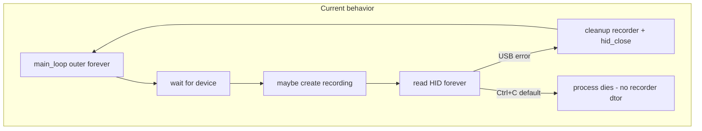

# Graceful exit and XDF close for emotiv_lsl

## Scope

- **In scope:** [`src/emotiv/emotiv_base.cpp`](C:/Users/pho/repos/EmotivEpoc/ACTIVE_DEV/emotiv-lsl-cpp/src/emotiv/emotiv_base.cpp) / [`emotiv_base.h`](C:/Users/pho/repos/EmotivEpoc/ACTIVE_DEV/emotiv-lsl-cpp/src/emotiv/emotiv_base.h) and [`src/emotiv/main.cpp`](C:/Users/pho/repos/EmotivEpoc/ACTIVE_DEV/emotiv-lsl-cpp/src/emotiv/main.cpp), plus [`src/emotiv/CMakeLists.txt`](C:/Users/pho/repos/EmotivEpoc/ACTIVE_DEV/emotiv-lsl-cpp/src/emotiv/CMakeLists.txt) if a small new source file is added.
- **Out of scope:** [`src/gui/main.cpp`](C:/Users/pho/repos/EmotivEpoc/ACTIVE_DEV/emotiv-lsl-cpp/src/gui/main.cpp) and [`src/cli/main.cpp`](C:/Users/pho/repos/EmotivEpoc/ACTIVE_DEV/emotiv-lsl-cpp/src/cli/main.cpp) — they do not construct [`recording`](C:/Users/pho/repos/EmotivEpoc/ACTIVE_DEV/emotiv-lsl-cpp/src/core/include/recording.h) or open XDF files.
- **No change required** to [`recording`](C:/Users/pho/repos/EmotivEpoc/ACTIVE_DEV/emotiv-lsl-cpp/src/core/src/recording.cpp) for correctness: `requestStop()` plus destroying the `unique_ptr<recording>` already runs `~recording()`, which joins threads and destroys `XDFWriter` (file close).

## Problem

[`main_loop`](C:/Users/pho/repos/EmotivEpoc/ACTIVE_DEV/emotiv-lsl-cpp/src/emotiv/emotiv_base.cpp) uses a non-terminating outer `while (true)` reconnect loop. The `recording` object lives as a **local** `unique_ptr` inside `main_loop`. On Ctrl+C / default process termination, that destructor often **does not run**, so the XDF may lack footers or be left in a bad state. [`hid_exit()`](C:/Users/pho/repos/EmotivEpoc/ACTIVE_DEV/emotiv-lsl-cpp/src/emotiv/emotiv_base.cpp) at the end of the function is currently **unreachable**.

## Design

1. **Cooperative shutdown flag** on `EmotivBase` (e.g. `std::atomic<bool> shutdown_requested_{false}`) with a public `requestShutdown() noexcept` that only sets the flag (async-signal-safe enough for the handler path; avoid iostream in the handler itself).
2. **Refactor `main_loop`** so every long wait or read loop observes `shutdown_requested_`:
   - **Device wait** (`while (!device)`): replace unbounded `sleep_for(kReconnectInterval)` with a short sleep (e.g. 100–200 ms) in an inner loop, re-checking the flag, so Ctrl+C is picked up within a bounded delay.
   - **HID read loop**: on `hid_read_timeout` returning `0`, if `shutdown_requested_`, **break** (same as a clean stop).
   - On `bytes_read < 0`: if shutting down, break **without** printing “reconnecting” (optional polish).
3. **Single cleanup block** after leaving the inner read loop (unchanged responsibilities): `recorder->requestStop(); recorder.reset();` if non-null; `hid_close(device)` **only if** `device != nullptr`; reset LSL outlets and `has_motion_data`.
4. **Outer loop exit**: after that cleanup, **`if (shutdown_requested_) break;`** so we do not start another reconnect cycle. After the outer loop, call **`hid_exit()`** once (finally makes it reachable).
5. **Platform hooks** (registered from `main` immediately before `main_loop()`, removed right after it returns):
   - **Windows:** [`SetConsoleCtrlHandler`](https://learn.microsoft.com/en-us/windows/console/handlerroutine) for `CTRL_C_EVENT`, `CTRL_BREAK_EVENT`, and `CTRL_CLOSE_EVENT`. Handler should **`return TRUE`** after setting the flag so the default immediate `ExitProcess` path is not used; the main thread then exits the loops and closes the XDF. Note: `CTRL_CLOSE_EVENT` allows only a few seconds—keeping sleeps short helps.
   - **POSIX (Linux/macOS):** `std::signal(SIGINT, …)` and `std::signal(SIGTERM, …)` setting the same flag. Handler must **only** set the flag (no `std::cout` in the handler for POSIX async-signal safety); the main thread can print “Shutdown requested…” when it observes the flag, if desired.
6. **Targeting `EmotivBase*` from handlers:** use a file-local `static std::atomic<EmotivBase*>` (or `std::atomic<void*>`) set before `main_loop()` and cleared after, so handlers call `requestShutdown()` on the active instance. Wrap install/remove in two small functions in either [`main.cpp`](C:/Users/pho/repos/EmotivEpoc/ACTIVE_DEV/emotiv-lsl-cpp/src/emotiv/main.cpp) or a dedicated [`src/emotiv/shutdown_hooks.cpp`](C:/Users/pho/repos/EmotivEpoc/ACTIVE_DEV/emotiv-lsl-cpp/src/emotiv/shutdown_hooks.cpp) + header to avoid cluttering `main.cpp` and to localize `#ifdef _WIN32` / `#include <windows.h>`.

## Verification

- Run `emotiv_lsl` with recording enabled; start streaming; Ctrl+C: console should show **`Closed XDF: …`** (from `~recording`) and process exit 0.
- Unplug dongle path should still reconnect when **not** shutting down; after Ctrl+C, process should **not** reconnect.
- Optional: close console window (Windows) and confirm file is still usable / footer written within the OS time limit.

## Files to touch

| File | Change |
|------|--------|
| [`emotiv_base.h`](C:/Users/pho/repos/EmotivEpoc/ACTIVE_DEV/emotiv-lsl-cpp/src/emotiv/emotiv_base.h) | `std::atomic<bool> shutdown_requested_`, `requestShutdown()` |
| [`emotiv_base.cpp`](C:/Users/pho/repos/EmotivEpoc/ACTIVE_DEV/emotiv-lsl-cpp/src/emotiv/emotiv_base.cpp) | Loop conditions, chunked device wait, post-inner-loop `hid_close` guard, outer break on shutdown, reachable `hid_exit()` |
| [`main.cpp`](C:/Users/pho/repos/EmotivEpoc/ACTIVE_DEV/emotiv-lsl-cpp/src/emotiv/main.cpp) **or** new `shutdown_hooks.*` | Install/remove handlers; register `&epocX` |
| [`CMakeLists.txt`](C:/Users/pho/repos/EmotivEpoc/ACTIVE_DEV/emotiv-lsl-cpp/src/emotiv/CMakeLists.txt) | Add `shutdown_hooks.cpp` only if split out |
