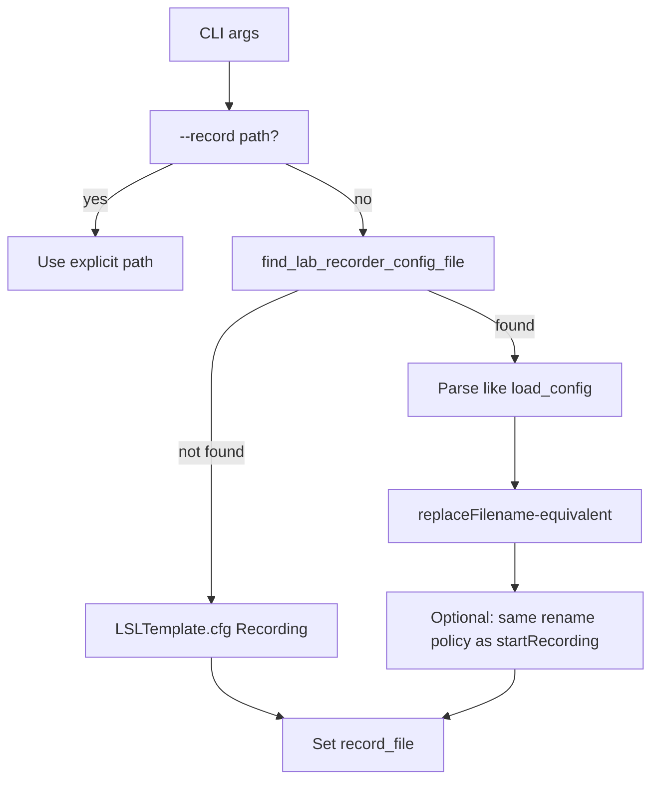

# LabRecorder `.cfg` parity for emotiv-lsl-cpp

## Source of truth (App-LabRecorder)

Treat these as the specification to mirror:

- Config load and storage keys: [`App-LabRecorder/src/mainwindow.cpp`](C:/Users/pho/repos/EmotivEpoc/ACTIVE_DEV/App-LabRecorder/src/mainwindow.cpp) — `load_config` (StudyRoot / PathTemplate / StorageLocation mutual exclusion, default `StudyRoot`, empty-template → BIDS UI path), `find_config_file`.
- Final string used for the file path: same file — `replaceFilename`, `counterPlaceholder`, `buildBidsTemplate`, and `startRecording` (root + template, `QDir::cleanPath`).

## Current implementation (emotiv-lsl-cpp)

- Discovery + resolution: [`emotiv-lsl-cpp/src/emotiv/lab_recorder_cfg.cpp`](C:/Users/pho/repos/EmotivEpoc/ACTIVE_DEV/emotiv-lsl-cpp/src/emotiv/lab_recorder_cfg.cpp), wired from [`emotiv-lsl-cpp/src/emotiv/main.cpp`](C:/Users/pho/repos/EmotivEpoc/ACTIVE_DEV/emotiv-lsl-cpp/src/emotiv/main.cpp) with `--record` override and optional [`LSLTemplate.cfg`](C:/Users/pho/repos/EmotivEpoc/ACTIVE_DEV/emotiv-lsl-cpp/LSLTemplate.cfg) `[Recording]` fallback.

## Gaps to close (ordered by impact on “identical names”)

### 1. Placeholder expansion must match `replaceFilename`

LabRecorder’s `replaceFilename` (UTC `QDateTime`, order of replacements) differs from the current C++ helpers in important ways:

| Token | LabRecorder ([`mainwindow.cpp`](C:/Users/pho/repos/EmotivEpoc/ACTIVE_DEV/App-LabRecorder/src/mainwindow.cpp) ~597–647) | Current emotiv (`expand_placeholders`) |
|--------|--------------------------------------------------------------------------------------------------------------------------|----------------------------------------|
| `%datetime` | `toString("yyyy-MM-ddTHHmmss.zzzZ")` — **no** colons between hour/min/sec | ISO string with `%H:%M:%S` — **different** |
| `%date` / `%time` | Both from **UTC** (`nowUtc`) | `%date` local, `%time` local with `%H-%M-%S` — **different** |
| `%time` format | `HHmmss.zzzZ` | Not equivalent |
| `%datetime_eeg` | **Not** a separate replace; `%datetime` matches the **prefix** of `%datetime_eeg`, leaving a literal `_eeg` segment (Qt `QString::replace`) | Replaces full `%datetime_eeg` first — **different** filename for templates like `LabRecorder_%hostname_%datetime_eeg.xdf` in [`LabRecorder.cfg`](C:/Users/pho/repos/EmotivEpoc/ACTIVE_DEV/emotiv-lsl-cpp/LabRecorder.cfg) |
| `%hostname` | `QHostInfo::localHostName()` then sanitize (whitespace + `[<>:\"/\\|?*]` → `_`) | `GetComputerName` / `gethostname` without same sanitization — can diverge |

**Implementation direction:** Refactor `expand_placeholders` to follow LabRecorder’s **same replacement order** (`%b`, `%p`, `%s`, `%a`, `%m`, counter, `%datetime`, `%date`, `%time`, `%hostname`) and formats. Implement `%datetime` with the compact UTC pattern equivalent to Qt’s `yyyy-MM-ddTHHmmss.zzzZ`. Do **not** pre-replace `%datetime_eeg` as a whole token unless you prove it matches Qt’s substring behavior for all supported patterns.

### 2. BIDS vs legacy counter: match `check_bids` logic from `load_config`

In LabRecorder, **any non-empty `PathTemplate` from the cfg** sets `check_bids` to **false**, so `counterPlaceholder()` is **`%n`**, not `%r`, even if the template text looks BIDS-like ([`load_config`](C:/Users/pho/repos/EmotivEpoc/ACTIVE_DEV/App-LabRecorder/src/mainwindow.cpp) ~255–262, ~693).

Current emotiv uses `bids_default || legacy_template.find("sub-%p") != npos` to choose `%r` vs `%n`, which **disagrees** with LabRecorder for hand-edited cfg paths.

**Rule:** `use_run_r` iff the template is the **default BIDS path** (no `PathTemplate` / `StorageLocation` template in cfg — i.e. same branch as `legacyTemplate.isEmpty()` after load). If `PathTemplate` (or derived legacy string from `StorageLocation`) is **present**, use **legacy** counter behavior (`%n` only), mirroring `counterPlaceholder()` with BIDS unchecked.

### 3. Default `%b` when `SessionBlocks` is present

LabRecorder loads `SessionBlocks` into the block combo and the **current** block drives `%b` ([`load_config`](C:/Users/pho/repos/EmotivEpoc/ACTIVE_DEV/App-LabRecorder/src/mainwindow.cpp) ~213–216).

emotiv always uses `"Default"` for `%b`. For parity when the cfg supplies blocks, use the **first** session block as the default `%b` (and keep `"Default"` when absent or empty).

**Note:** Qt `QSettings` may encode string lists in INI in non-flat ways. Options: (a) extend the parser to handle the same patterns LabRecorder writes/reads (including comma-quoted one-line forms seen in comments), or (b) document a minimal subset if full Qt list encoding is out of scope — prefer (a) for “same .cfg files”.

### 4. Config file discovery order vs `QStandardPaths`

LabRecorder order ([`find_config_file`](C:/Users/pho/repos/EmotivEpoc/ACTIVE_DEV/App-LabRecorder/src/mainwindow.cpp) ~674–678):

1. CWD  
2. All `standardLocations(AppConfigLocation)`  
3. All `standardLocations(AppDataLocation)`  
4. Executable directory  

Filename is **`LabRecorder.cfg`** when sharing configs with LabRecorder (upstream uses `completeBaseName() + ".cfg"`). emotiv already hardcodes `LabRecorder.cfg`, which matches that workflow.

**Gap:** On Windows, Qt’s `standardLocations(AppConfigLocation)` includes paths under **`ProgramData`** as well as user `AppData\Local` (see [Qt docs](https://doc.qt.io/qt-6/qstandardpaths.html#StandardLocation-enum)); emotiv currently checks `LOCALAPPDATA\LabRecorder` and `APPDATA\LabRecorder` only. Extend `find_lab_recorder_config_file` to iterate the **same conceptual list** (per OS), or add the documented extra roots so a cfg only present under `ProgramData\LabRecorder` is still found.

macOS/Linux: keep matching **Preferences** / **Application Support** / XDG patterns to the same Qt tables where feasible.

### 5. Existing-file behavior (optional parity)

LabRecorder **before** opening the file: if the resolved path exists, **renames** to `basename_oldN.ext` ([`startRecording`](C:/Users/pho/repos/EmotivEpoc/ACTIVE_DEV/App-LabRecorder/src/mainwindow.cpp) ~446–464). emotiv’s resolver either picks a new `%n`/`%r` or returns a path without checking existence when there is no counter — **not identical** for fixed names (e.g. same-second `%datetime` collision).

Decide one of: (a) mirror rename-to-`_oldN` when the resolved path exists and the template has **no** counter placeholders; (b) document intentional difference; (c) always check existence and bump counter only when placeholders include `%n`/`%r`. **(a)** is closest to LabRecorder.

### 6. StorageLocation prefix split

Logic should remain equivalent to `QFileInfo(path_root).absolutePath()` + stripping that prefix from the original string ([`load_config`](C:/Users/pho/repos/EmotivEpoc/ACTIVE_DEV/App-LabRecorder/src/mainwindow.cpp) ~228–242). Re-audit [`strip_study_root_prefix`](C:/Users/pho/repos/EmotivEpoc/ACTIVE_DEV/emotiv-lsl-cpp/src/emotiv/lab_recorder_cfg.cpp) against mixed `\`/`/` paths using the same normalization Qt would apply.

### 7. Docs and tests

- Update [`emotiv-lsl-cpp/README.md`](C:/Users/pho/repos/EmotivEpoc/ACTIVE_DEV/emotiv-lsl-cpp/README.md) so documented tokens and UTC behavior match LabRecorder (remove any claims that already disagree with upstream).
- Add focused tests or a small self-check (even a script that compares resolved strings given a frozen clock mock if you add a test hook) for: `%datetime_eeg` pattern, `%n` vs `%r` when `PathTemplate` is set, and `StorageLocation` split.

## Out of scope unless you explicitly want feature parity

LabRecorder cfg keys that affect **which LSL streams** are recorded, **OnlineSync**, **RCSPort**, **AutoStart**, etc. do not change the **output path** in upstream; emotiv can continue to ignore them for path resolution. If you later want behavioral parity (e.g. required streams), that would be a separate task touching the Emotiv recorder, not just `lab_recorder_cfg`.

## Mermaid: resolution flow (target)

