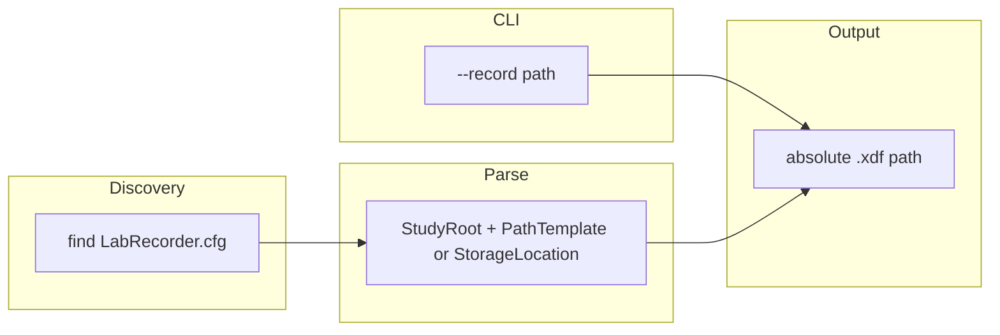

# LabRecorder.cfg discovery and path resolution for emotiv_lsl

## Source of truth (upstream)

App-LabRecorder discovers the default config in [`MainWindow::find_config_file`](https://github.com/labstreaminglayer/App-LabRecorder/blob/master/src/mainwindow.cpp) (see comment ~lines 573–581):

1. Optional explicit path from `-c` / `--config` (if provided)
2. Otherwise `LabRecorder.cfg` (i.e. `QFileInfo(applicationFilePath()).completeBaseName() + ".cfg"`) in each of these **directories**, first hit wins:
   - Current working directory
   - Each path from `QStandardPaths::AppConfigLocation`
   - Each path from `QStandardPaths::AppDataLocation`
   - Directory containing **the LabRecorder executable** (`exeInfo.path()`)

Parsing and storage keys are implemented in `MainWindow::load_config` using Qt `QSettings` INI format: **`StudyRoot`**, **`PathTemplate`**, optional **`StorageLocation`**, mutual exclusion rules, default `StudyRoot` when empty (`DocumentsLocation/CurrentStudy`), etc.

Filename wildcard expansion for the **legacy** (non-BIDS) template lives in `MainWindow::replaceFilename` (same file). Upstream has evolved (e.g. `QDateTime` include suggests additional `%` tokens in newer versions); **implementation should track the same substitution set as the App-LabRecorder version you target**—minimum for your checked-in [`LabRecorder.cfg`](C:/Users/pho/repos/EmotivEpoc/ACTIVE_DEV/emotiv-lsl-cpp/LabRecorder.cfg): `%hostname`, `%datetime` / `%datetime_eeg` (and any compound forms present in current upstream `replaceFilename`).

## Behavior (agreed)

| Input | Result |
|-------|--------|
| `--record <path>` | Use that path (unchanged). |
| No `--record` | If **`LabRecorder.cfg`** is found and yields a resolvable output path, set `record_file` to that path. **Do not require `AutoStart=1`.** |
| No `--record`, LabRecorder path unusable | Optional **fallback**: existing [`LSLTemplate.cfg`](C:/Users/pho/repos/EmotivEpoc/ACTIVE_DEV/emotiv-lsl-cpp/LSLTemplate.cfg) `[Recording]` via [`resolveRecordingOutputPath`](C:/Users/pho/repos/EmotivEpoc/ACTIVE_DEV/emotiv-lsl-cpp/src/core/include/lsltemplate/Config.hpp) (backward compatibility). |

## Implementation sketch

1. **New module** (recommended under `src/emotiv/`, e.g. `lab_recorder_cfg.h` / `lab_recorder_cfg.cpp`) to avoid bloating [`main.cpp`](C:/Users/pho/repos/EmotivEpoc/ACTIVE_DEV/emotiv-lsl-cpp/src/emotiv/main.cpp)):
   - **`findLabRecorderConfigFile()`** — Mirror App-LabRecorder’s search order for the fixed filename **`LabRecorder.cfg`**. Without Qt, approximate `AppConfigLocation` / `AppDataLocation` using the same rules Qt uses when **no organization name is set** (LabRecorder’s [`main.cpp`](https://github.com/labstreaminglayer/App-LabRecorder/blob/master/src/main.cpp) does not set org/app name): e.g. Windows `FOLDERID_LocalAppData` + `\LabRecorder` (and any extra candidates Roaming lists return), macOS `~/Library/Preferences` / Application Support patterns, Linux `$XDG_CONFIG_HOME` / `~/.config` per [Qt QStandardPaths](https://doc.qt.io/qt-6/qstandardpaths.html). Include **executable directory** of **emotiv_lsl** in the list (like upstream includes the running app’s exe dir—here `emotiv_lsl.exe` so a copied `LabRecorder.cfg` next to emotiv still works).
   - **`parseLabRecorderStorage()`** — INI read for `StudyRoot`, `PathTemplate`, `StorageLocation` with the same exclusivity rules as upstream `load_config` (reject invalid combos or match error messages).
   - **`expandLabRecorderTemplate()`** — Port wildcard behavior from upstream `replaceFilename` + any **additional** replacements done at record start in current App-LabRecorder (diff `replaceFilename` / `startRecording` in upstream). Use sane **defaults** for UI-only fields when missing from cfg (e.g. block `%b`, participant `%p`, session `%s`, counter `%n`/`%r`, modality `%m`) so headless resolution matches what LabRecorder would show with default widgets.
   - **`resolveLabRecorderOutputPath()`** — Combine study root + template, `create_directories` for parent, return `std::optional<std::filesystem::path>` (absolute). Optionally mirror `buildFilename`’s “find first free `%n`/`%r`” loop if template contains the counter placeholder and the file already exists.

2. **[`main.cpp`](C:/Users/pho/repos/EmotivEpoc/ACTIVE_DEV/emotiv-lsl-cpp/src/emotiv/main.cpp)** — After argv parsing:
   - If `--record` set → keep.
   - Else optionally support **`-c` / `--config <path>`** pointing at a LabRecorder-style file (same as App-LabRecorder) for explicit loads.
   - Else try `findLabRecorderConfigFile()` → parse → resolve path; if set, assign `record_file`.
   - Else keep existing `LSLTemplate.cfg` + `[Recording]` fallback.

3. **Config cleanup / docs**
   - **[`LSLTemplate.cfg`](C:/Users/pho/repos/EmotivEpoc/ACTIVE_DEV/emotiv-lsl-cpp/LSLTemplate.cfg)** — Either remove `[Recording]` (if you want a single source of truth) or leave documented as **fallback only** when `LabRecorder.cfg` is absent.
   - **[`README.md`](C:/Users/pho/repos/EmotivEpoc/ACTIVE_DEV/emotiv-lsl-cpp/README.md)** — Replace the emotiv XDF section to describe **LabRecorder.cfg** discovery, placeholders, and that `--record` overrides; mention fallback to `[Recording]` in `LSLTemplate.cfg` if kept.

4. **Tests / verification**
   - Place a minimal `LabRecorder.cfg` next to the built `emotiv_lsl` with a `StudyRoot` under `%TEMP%` and a simple `PathTemplate` (no BIDS) and confirm the printed path and file creation.
   - Confirm a real LabRecorder-installed `LabRecorder.cfg` path is found when placed where Qt would (may require one manual check on Windows with Process Monitor or logging discovered paths).

## Risk note

**Always resolving a path whenever cfg parses** (ignoring `AutoStart`) means any machine with a valid `LabRecorder.cfg` could start writing XDF as soon as emotiv runs with `--record` omitted. You explicitly chose this; if that becomes too aggressive, reintroduce gating (e.g. `AutoStart` or a new `EmotivRecord=1` key) in a follow-up.
