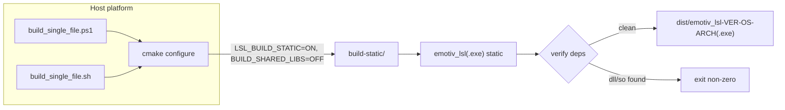

## Goal

Produce a single, self-contained `emotiv_lsl[.exe]` with no sibling `.dll` / `.so` / `.dylib` / `.framework` files at runtime, on the host platform.

## Approach: static link via CMake cache vars

All three current runtime dependencies already support static builds — see [build/_deps/liblsl-src/cmake/ProjectOptions.cmake](build/_deps/liblsl-src/cmake/ProjectOptions.cmake) line 6, [build/_deps/hidapi-src/CMakeLists.txt](build/_deps/hidapi-src/CMakeLists.txt) line 50, and [xdfwriter/CMakeLists.txt](xdfwriter/CMakeLists.txt) line 15. No source changes needed; the scripts pass:

- `LSL_BUILD_STATIC=ON` — produces static `liblsl` and sets the public `LIBLSL_STATIC` define so consumers don't `dllimport`.
- `BUILD_SHARED_LIBS=OFF` — flips both `hidapi_winapi`/`_darwin`/`_libusb` and `xdfwriter` to STATIC. Safe for `lsl` because `add_library(lsl ${LSL_LIB_TYPE} ...)` is explicit.
- Windows only: `CMAKE_MSVC_RUNTIME_LIBRARY=MultiThreaded` — statically links the MSVC CRT so the resulting `.exe` has no VC++ Redistributable dependency either. Works for liblsl/hidapi/xdfwriter too via CMake policy CMP0091.
- macOS only: `LSL_FRAMEWORK=OFF` — prevents liblsl from being built as `lsl.framework` when static.
- Standard project flags from [CMakePresets.json](CMakePresets.json): `LSLTEMPLATE_BUILD_GUI=OFF`, `LSLTEMPLATE_BUILD_CLI=OFF`, `EMOTIVLSL_BUILD_EMOTIV=ON`, `CMAKE_BUILD_TYPE=Release`.

A dedicated build directory `build-static/` is used so the existing `build/` (used by [run.ps1](run.ps1)) is not clobbered — switching back and forth between dynamic and static builds remains friction-free.

## Files

### `scripts/build_single_file.ps1` (Windows; pwsh 7+)

- Mirrors structure / style of [run.ps1](run.ps1): `Set-StrictMode`, `$ErrorActionPreference='Stop'`, colored progress lines.
- Selects generator `Visual Studio 17 2022` and clears stale cache if the cached generator differs (same logic as [run.ps1](run.ps1) lines 30‑39, but scoped to `build-static/`).
- Configure step:

```powershell
cmake -S $root -B $buildDir -G "Visual Studio 17 2022" `
  -DCMAKE_BUILD_TYPE=Release `
  -DLSLTEMPLATE_BUILD_GUI=OFF -DLSLTEMPLATE_BUILD_CLI=OFF -DEMOTIVLSL_BUILD_EMOTIV=ON `
  -DLSL_BUILD_STATIC=ON -DBUILD_SHARED_LIBS=OFF `
  -DCMAKE_MSVC_RUNTIME_LIBRARY=MultiThreaded `
  -DCMAKE_INSTALL_PREFIX="$buildDir/install"
```

- Build: `cmake --build $buildDir --config Release -j`
- Copy resulting `build-static/src/emotiv/Release/emotiv_lsl.exe` to `dist/emotiv_lsl-<version>-windows-<arch>.exe` (version pulled from `project()` in [CMakeLists.txt](CMakeLists.txt) line 22, defaulting to `2.0.0`).
- Verification: run `dumpbin /dependents` on the `.exe` (if `dumpbin` is on PATH inside a VS dev shell), warn if any of `lsl.dll`, `hidapi.dll`, or `xdfwriter.dll` appear; otherwise just print `Get-Item` size in MB.

### `scripts/build_single_file.sh` (macOS / Linux; bash)

- `#!/usr/bin/env bash`, `set -euo pipefail`.
- Detects OS via `uname -s`, picks generator `Ninja` if available else `Unix Makefiles`.
- Configure:

```bash
cmake -S "$ROOT" -B "$BUILD_DIR" -G "$GEN" \
  -DCMAKE_BUILD_TYPE=Release \
  -DLSLTEMPLATE_BUILD_GUI=OFF -DLSLTEMPLATE_BUILD_CLI=OFF -DEMOTIVLSL_BUILD_EMOTIV=ON \
  -DLSL_BUILD_STATIC=ON -DBUILD_SHARED_LIBS=OFF \
  $( [ "$(uname -s)" = "Darwin" ] && echo "-DLSL_FRAMEWORK=OFF" ) \
  -DCMAKE_INSTALL_PREFIX="$BUILD_DIR/install"
```

- Build: `cmake --build "$BUILD_DIR" -j`
- Copy `build-static/src/emotiv/emotiv_lsl` to `dist/emotiv_lsl-<version>-<os>-<arch>`.
- Verification: `ldd` (Linux) or `otool -L` (macOS) — fail loudly if `liblsl`, `hidapi`, or `xdfwriter` show up as dynamic deps.

## Known cosmetic side-effects (not blockers)

- On Windows, the `add_custom_command(... POST_BUILD)` blocks at [src/emotiv/CMakeLists.txt](src/emotiv/CMakeLists.txt) lines 34‑54 will copy the now-static `.lib` archives next to the `.exe`. The scripts will copy only `emotiv_lsl.exe` to `dist/`, so this leaks only inside `build-static/` and is invisible in the final artifact.
- `LSL_install_liblsl(DESTINATION ".")` in [CMakeLists.txt](CMakeLists.txt) line 246 still runs, but for STATIC `lsl` it resolves to `install(TARGETS lsl RUNTIME ...)` which is a no-op for static targets — harmless.
- The scripts skip `cmake --install` entirely; they read the binary directly from the build tree, so even those install-time quirks don't affect the `dist/` output.

## Out of scope (deferred)

- Macro for the build dir is hard-coded `build-static/`; not parameterized.
- No new CMake preset added (per user's preference for minimal edits to existing files); scripts pass `-D` flags directly.
- No Cosmopolitan/APE-style cross-platform single binary — host-only.

## Mermaid: dataflow


